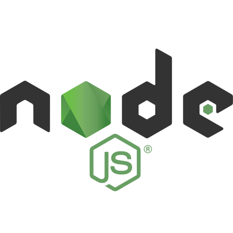
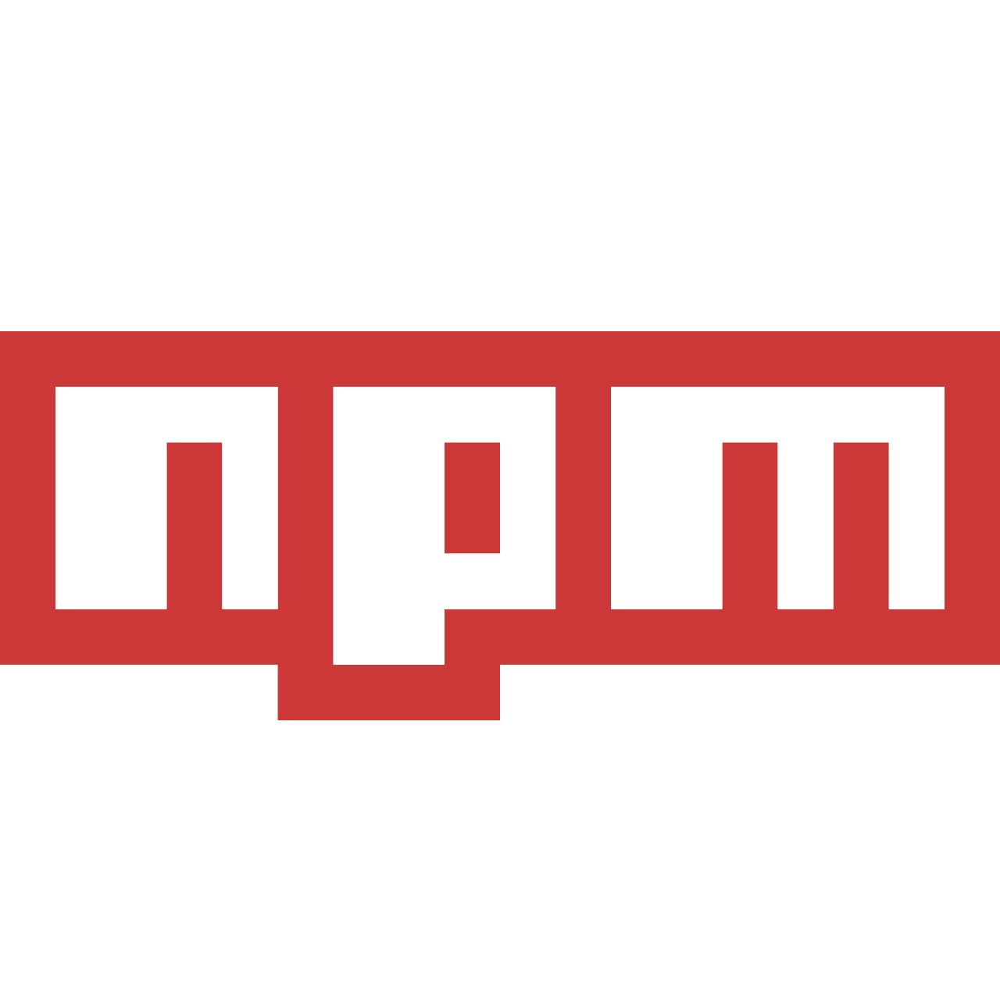

GitHub readme

  

    <h1 style="font-family: Luminari, fantasy, 'Poppins'; letter-spacing: 5px; text-align: center;">My Interests</h1>
    <table>
      <tr style="border: none">
        <td style="border: none"><a href="https://flutter.dev"><a/></td>
        <td style="border: none"><a href="https://www.javascript.com"><a/></td>
        <td style="border: none"><a href="https://aws.amazon.com"><a/></td>
        <td style="border: none"><a href="https://www.mongodb.com"><a/></td>
        <td style="border: none"><a href="https://developer.android.com"><a/></td>
      <tr style="border: none">
        <td style="border: none"><a href="https://nodejs.org/en/"><a/></td>
        <td style="border: none"><a href="http://expressjs.com"><a/></td>
        <td style="border: none"><a href="https://www.npmjs.com"><a/></td>
        <td style="border: none"><a href="https://www.postgresql.org"><a/></td>
        <td style="border: none"><a href="https://developer.apple.com"><a/></td>
      </tr>
    </table>
  

  
 
    Visitor count 
     
  

  

