<details>
<summary>#My Portfolio</summary>

```dart
  MustafaKurt.defaultProfile()
      : name = "Mustafa",
        username = "Kurt",
        location = "Ankara, Turkey",
        age = 26;
```

## Professional Overview
Versatile software developer specializing in cross-platform mobile development with Flutter and backend development using Node.js. Experienced in designing and implementing solutions with MongoDB and PostgreSQL databases, focusing on user experience and performance optimization. Proficient in deployment processes utilizing Git version control and AWS RDS infrastructure.

## Featured Projects

### Perfume Atelier - iOS & Android Application
*Cross-platform perfume e-commerce application developed independently with Flutter, featuring integrated e-POS payment system*

<div style="display: flex; flex-direction: row; gap: 10px; justify-content: space-between; align-items: center;">
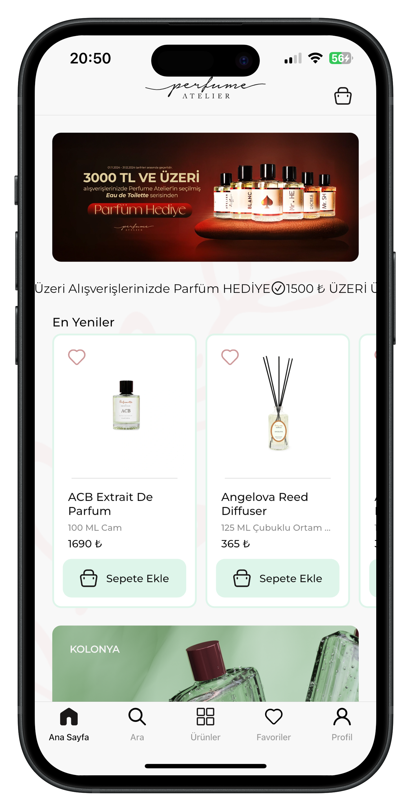
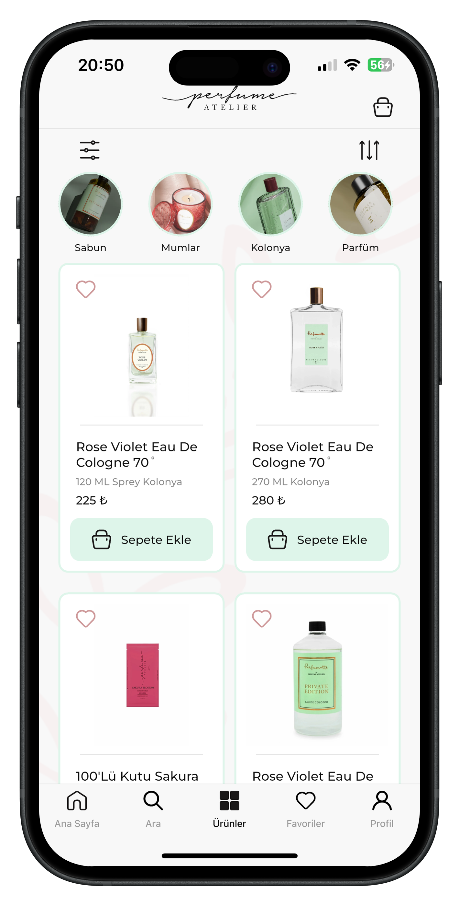
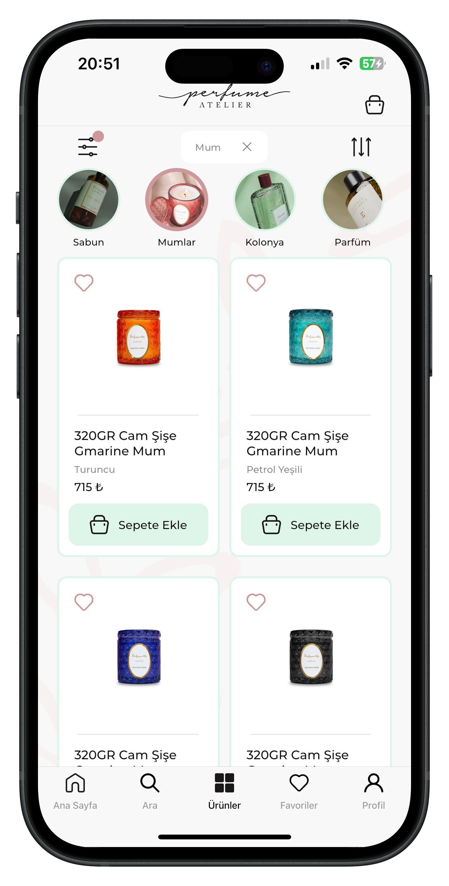
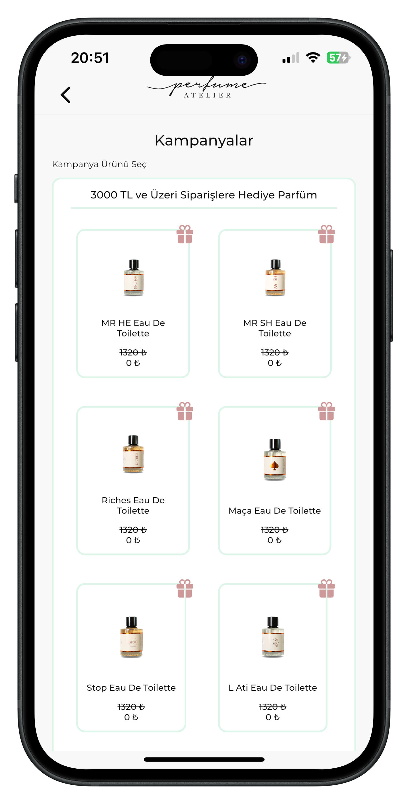
</div>


**Technical Infrastructure:**
- Flutter Framework with Clean Architecture
- State Management with GetIt & Provider
- RESTful API Integration
- Firebase Crashlytics & Firebase Analytics
- e-POS Payment System Integration
- FCM Push Notifications

**App Stores:**
- [App Store](https://apps.apple.com/tr/app/perfume-atelier/id6505069260?l=tr)
- [Google Play Store](https://play.google.com/store/apps/details?id=com.osicrew.perfume_atelier&hl=tr)

---

### Nanografi - Backend Development
*Contribution to enterprise-level e-commerce platform*

**Key Contributions:**
- Implementation of robust API endpoints
- Optimization of database queries
- System performance improvements

**Project Link:** [Nanografi](https://nanografi.com)

---

### Tagitag - Mobile Application
*Social media tagging and content management platform*


**Technical Details:**
- Flutter/Dart
- BLoC Architecture
- Local Data Storage (Hive)
- Custom Animation Framework
- Media Management
- Social Platform Integration

---

### Para Piyasam - Financial Markets Application
*Real-time financial market tracking and analysis platform*

<div style="display: flex; flex-direction: row; gap: 10px; justify-content: space-between; align-items: center;">
  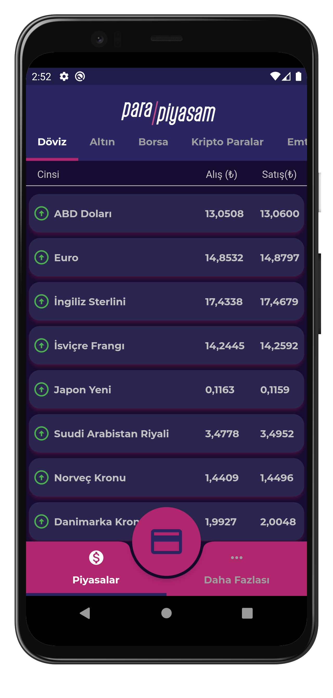
  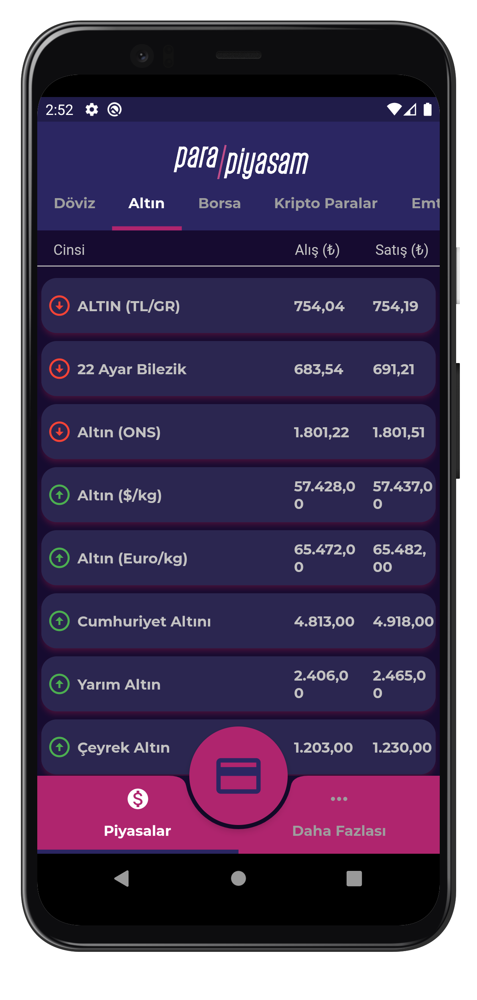
  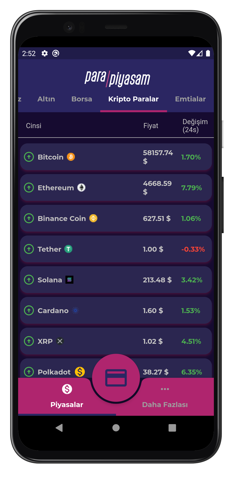
</div>
<div style="display: flex; flex-direction: row; gap: 10px; justify-content: space-between; align-items: center; margin-top: 10px;">
  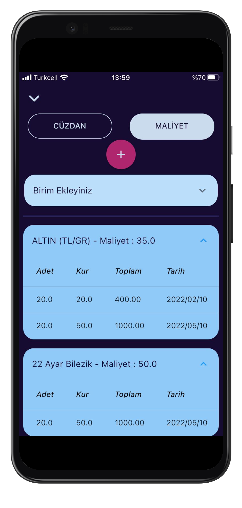
  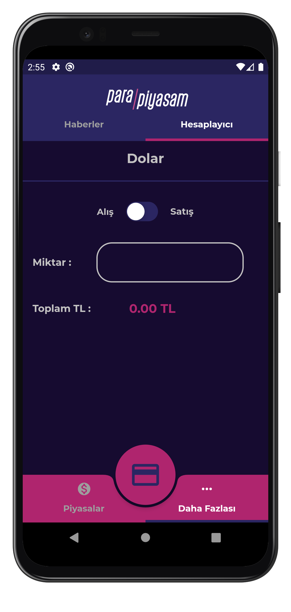
  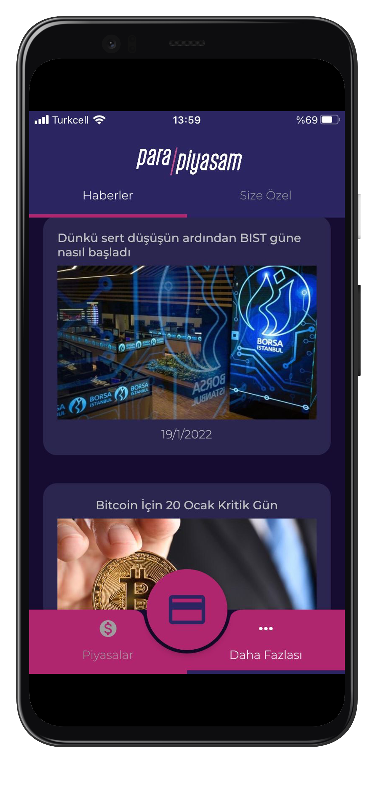
</div>

**Teknik Mimari:**
- Flutter Framework
- GetX State Management
- Real-Time Data Integration
- Advanced Graphical Libraries
- Secure Local Storage
- Socket.io Integration

---

### Nöbetçi Noter - Location Services Application
*Notary office locator and information system*


**Teknik Altyapı:**
- Flutter Framework
- Google Maps Integration
- Location Services
- RESTful API Integration
- Local Data Management
- Material Design Components

## Technical Expertise

### Development
- Cross-Platform Mobile Development (Flutter)
- App Store Publishing and Certification Process
- Google Play Store Distribution and Publishing Management
- Backend Integration
- API Development
- Linux Bash Scripting
- AWS RDS
- PostgreSQL
- MongoDB
- Node.js
- AWS EC2

### Tools & Technologies
- Version Control (Git)
- CI/CD
- Firebase Services
- Cloud Services
- Analytics Integration

## Contact Information
- E-mail: [mustafakurt98@outlook.com](mailto:mustafakurt98@outlook.com)
- LinkedIn: [Mustafa Kurt](https://linkedin.com/in/mustafakurt98)
- GitHub: [MustafaKurt98](https://github.com/mustafakurt98)


</details>

<!-- - 📱 I’m interested in mobile development & UI-UX
- 💙 I’m currently learning Dart-Flutter and Figma
- 🧑🏻‍💻 I'm trying to learn Node.js recently -->


<div>
<h1 style="font-family: Luminari, fantasy, 'Poppins'; letter-spacing: 5px;">MY ARSENAL</h1>
<table>
  <tr style="border: none">
    <td style="border: none"><a href="https://flutter.dev"><a/></td>
    <td style="border: none"><a href="https://www.javascript.com">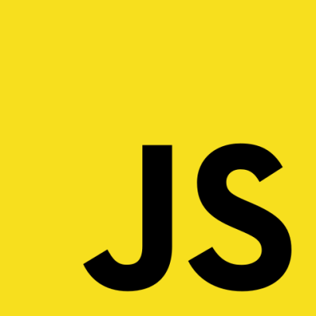<a/></td>
    <td style="border: none"><a href="https://aws.amazon.com"><a/></td>
    <td style="border: none"><a href="https://www.mongodb.com">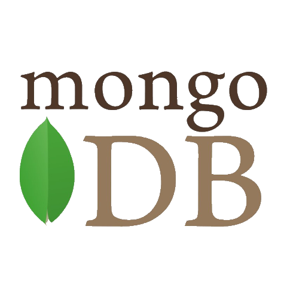<a/></td>
  <tr style="border: none">
    <td style="border: none"><a href="https://nodejs.org/en/">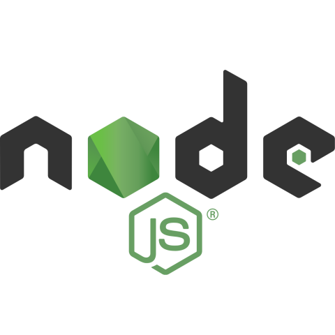<a/></td>
    <td style="border: none"><a href="http://expressjs.com"><a/></td>
    <td style="border: none"><a href="https://www.npmjs.com">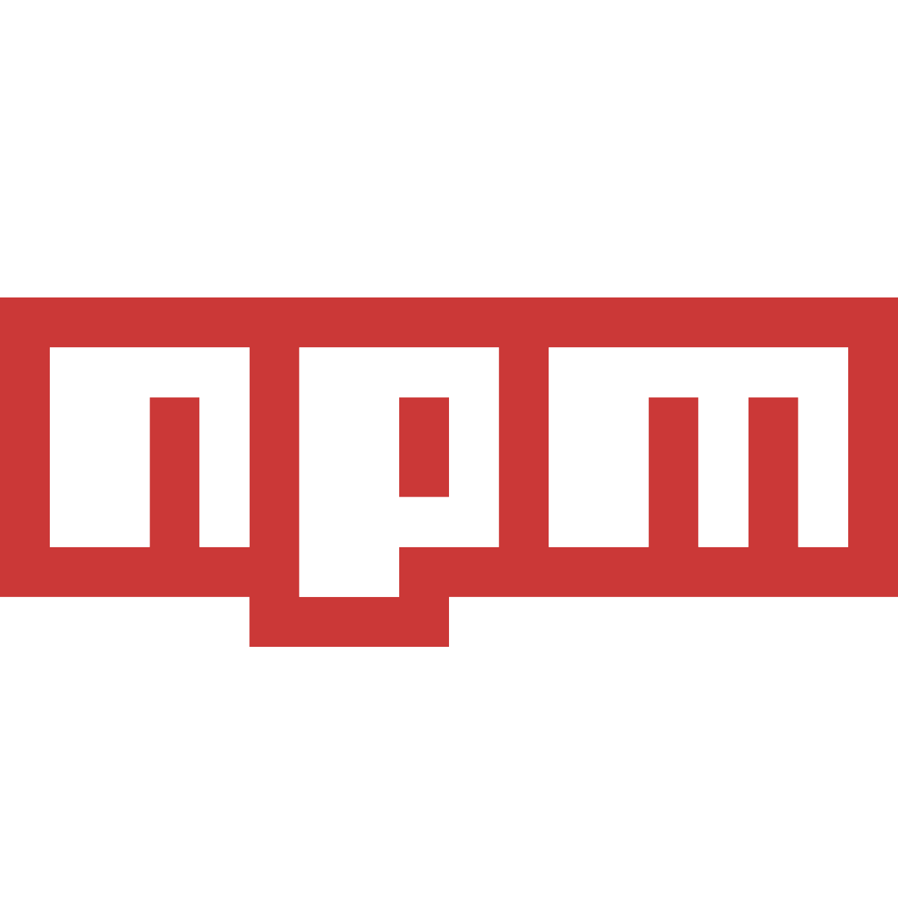<a/></td>
    <td style="border: none"><a href="https://www.postgresql.org"><a/></td>
  </tr>
</table>
</div>

<div style="block-size: border-box; height: 15px"></div>

<dl>
  <dd>
    <dl>
      <dd>
         <dl>
          <p align="left"> 
            &nbsp;&nbsp;&nbsp;&nbsp;&nbsp;&nbsp;&nbsp;&nbsp;&nbsp;
            &nbsp;&nbsp;&nbsp;&nbsp;&nbsp;&nbsp;&nbsp;&nbsp;&nbsp;
            Visitor count<br>
             
           </p>
          </dl>
      </dd>
    </dl>
  </dd>
</dl>

<div style="block-size: border-box; height: 25px"></div>

<!---
MustafaKurt98/MustafaKurt98 is a ✨ special ✨ repository because its `README.md` (this file) appears on your GitHub profile.
You can click the Preview link to take a look at your changes.
--->
